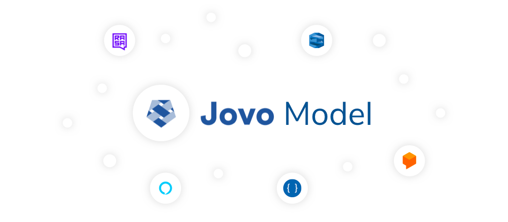

# Jovo Model

> To view this page on the Jovo website, visit https://www.jovo.tech/marketplace/jovo-model



The Jovo Model is a language model abstraction layer that works across NLU providers. It allows you to maintain a language model in a single source of truth and then translate it into different platform schemas like Amazon Alexa, Google Assistant, Dialogflow, Rasa NLU, Microsoft LUIS, and more.

* [Introduction](#introduction)
* [Supported Platforms](#supported-platforms)
* [Model Structure](#model-structure)
   * [Invocation](#invocation)
   * [Intents](#intents)
   * [Input Types](#input-types)
   * [Platform-specific Elements](#platform-specific-elements)
* [Using the Jovo Model with the Jovo CLI](#using-the-jovo-model-with-the-jovo-cli)
   * [Models Folder](#models-folder)
   * [Platforms Folder](#platforms-folder)
   * [Project Configuration](#project-configuration)
* [Using the Jovo Model npm Packages](#using-the-jovo-model-npm-packages)
   * [Model Conversions](#model-conversions)
   * [Updating the Model](#updating-the-model)
* [Contributing](#contributing)


## Introduction

The Jovo Framework works with many different [platforms](https://www.jovo.tech/marketplace/tag/platforms) and [natural language understanding (NLU) providers](https://www.jovo.tech/marketplace/tag/nlu) that turn spoken or written language into structured meaning. Each of these services have their own schema that needs to be used to train their models. If you want to use more than one provider, designing maintaining the different language models can become a tedious task.

The Jovo Model enables you to store language model information in a single JSON file. For Jovo projects, you can find the language model files in the `/models` folder:


The Jovo Model is mainly used by the [Jovo CLI](https://www.jovo.tech/marketplace/jovo-cli)'s [`build` command](https://www.jovo.tech/marketplace/jovo-cli/build) which turns the files into platform specific models like Alexa Interaction Models and Dialogflow agents. These resulting models can then be deployed to the respective platforms and trained there. Learn more here: [Using the Jovo Model with the Jovo CLI](#using-the-jovo-model-with-the-jovo-cli).

We chose to open source this repository to provide more flexibility to Jovo users and tool providers. You can directly access the Jovo Model features from your code and make transformations yourself. Learn more here: [Using the Jovo Model npm Packages](#using-the-jovo-model-npm-packages).


## Supported Platforms

The Jovo Model supports the following NLU providers (see the [`packages` folder in the `jovo-model` repository](https://github.com/jovotech/jovo-model/tree/master/packages)):
* [Amazon Alexa](./docs/amazon-alexa.md)
* [Amazon Lex](./docs/amazon-lex.md)
* [Google Dialogflow](./docs/dialogflow.md)
* [Google Assistant Conversational Actions](./docs/google-assistant.md) (alpha)
* [Microsoft LUIS](./docs/microsoft-luis.md)
* [Rasa NLU](./docs/rasa.md) (alpha)
* [NLP.js](./docs/nlpjs.md) (alpha)

## Model Structure

Every language you choose to support will have its very own language model (`en-US`, `de-DE`, etc.).

Each locale is represented by its on model. For example, the `en-US.json` in the [Jovo "Hello World" template](https://github.com/jovotech/jovo-templates/blob/master/01_helloworld/javascript/models/en-US.json) looks like this:

```javascript
{
	"invocation": "my test app",
	"intents": [
		{
			"name": "HelloWorldIntent",
			"phrases": [
				"hello",
				"say hello",
				"say hello world"
			]
		},
		{
			"name": "MyNameIsIntent",
			"phrases": [
				"{name}",
				"my name is {name}",
				"i am {name}",
				"you can call me {name}"
			],
			"inputs": [
				{
					"name": "name",
					"type": {
						"alexa": "AMAZON.US_FIRST_NAME",
						"dialogflow": "@sys.given-name"
					}
				}
			]
		}
	],
	"alexa": {
		"interactionModel": {
			"languageModel": {
				"intents": [
					{
						"name": "AMAZON.CancelIntent",
						"samples": []
					},
					{
						"name": "AMAZON.HelpIntent",
						"samples": []
					},
					{
						"name": "AMAZON.StopIntent",
						"samples": []
					}
				]
			}
		}
	},
	"dialogflow": {
		"intents": [
			{
				"name": "Default Fallback Intent",
				"auto": true,
				"webhookUsed": true,
				"fallbackIntent": true
			},
			{
				"name": "Default Welcome Intent",
				"auto": true,
				"webhookUsed": true,
				"events": [
					{
						"name": "WELCOME"
					}
				]
			}
		]
	}
}
```

The Jovo Model consists of several elements, which we will go through step by step in this section.

* [Invocation](#invocation)
* [Intents](#intents)
    * [Intent Name](#intent-name)
    * [Phrases](#phrases)
    * [Inputs](#inputs)
* [Input Types](#input-types)
    * [Input Type Name](#input-type-name)
    * [Values](#values)
    * [Synonyms](#synonyms)
* [Platform Specific Elements](#platform-specific-elements)


### Invocation

The `invocation` is used by some voice assistant platforms as the "app name" to access the app (see [Voice App Basics](https://www.jovo.tech/docs/voice-app-basics) in the Jovo Docs).

```javascript
"invocation": "my test app",
```

It is possible to add platform-specific invocations like this:

```javascript
"invocation": {
    "alexaSkill": "my test skill",
    "googleAction": "my test action"
},
```

Currently, this element is supported by [Alexa Skills](./docs/amazon-alexa.md) and [Google Assistant Conversational Actions](./docs/google-assistant.md). If you use Google Assistant with [Dialogflow](./docs/dialogflow.md), you need to set the invocation name manually in the Actions on Google console.  


### Intents

Intents can be added to the JSON as objects that include:

* a [`name`](#intent-name),
* sample [`phrases`](#phrases), and 
* [`inputs`](#inputs) (optional)

This is how the `MyNameIsIntent` from the Jovo "Hello World" sample app looks like:

```javascript
{  
    "name": "MyNameIsIntent",
    "phrases": [  
        "{name}",
        "my name is {name}",
        "i am {name}",
        "you can call me {name}"
    ],
    "inputs": [  
        {  
            "name": "name",
            "type": {  
                "alexa": "AMAZON.US_FIRST_NAME",
                "dialogflow": "@sys.given-name"
            }
        }
    ]
}
```

#### Intent Name

The `name` specifies how the intent is called on the platforms. We recommend using a consistent standard. In our examples, we add `Intent` to each name, like `MyNameIsIntent`.

#### Phrases

This is an array of example `phrases` that will be used to train the language model on the respective NLU platforms.

Some providers use different names for these phrases, for example utterances or "user says."

#### Inputs

Often, phrases contain variable input such as slots or entities, as some NLU services call them. In the Jovo Model, they are called `inputs`.

Inputs consist of a `name` and a `type` (learn more in the [Input Types](#input-types) section). For example an intent with phrases like `I live in {city}` would come with an input like this:

```javascript
"inputs": [
    {
        "name": "city",
        "type": "myCityInputType"
    }
]
```

You can also choose to provide different input types for each NLU service:

```javascript
"inputs": [
    {
        "name": "name",
        "type": {
            "alexa": "AMAZON.US_FIRST_NAME", 
            "dialogflow": "@sys.given-name"
        }
    }
]
```

You can either reference input types defined in the [`inputTypes` array](#input-types) array, or reference built-in input types provided by the respective NLU platforms (like `AMAZON.US_FIRST_NAME` for Alexa).


### Input Types

The `inputTypes` array lists all the input types that are referenced as `inputs` inside `intents`.

Each input type contains:
* a [`name`](#input-type-name),
* [`values`](#values), and
* [`synonyms`](#synonyms) (optional).

```javascript
"inputTypes": [
    {
        "name": "myCityInputType",
        "values": [
            {
                "value": "Berlin"
            },
            {
                "value": "New York",
                "synonyms": [
                    "New York City"
                ]
            }
        ]
    }
],
```

#### Input Type Name

The `name` specifies how the input type is referenced. Again, we recommend to use a consistent style throughout all input types to keep it organized.

#### Values

This is an array of elements that each contain a `value` and optionally `synonyms`. With the values, you can define which inputs you're expecting from the user.

#### Synonyms

Sometimes different words have the same meaning. In the example above, we have a main value `New York` and a synonym `New York City`. 

To learn more about how these input values and synonyms can be accessed in your Jovo app, take a look at the Jovo Docs: [Routing > Input](https://www.jovo.tech/docs/routing/input#how-to-access-input).


### Platform-specific Elements

Some intents or input types may be needed for just some platforms. You can define them as additional elements as shown for Alexa in the example below:

```javascript
"alexa": {
    "interactionModel": {
        "languageModel": {
            "intents": [
                {
                    "name": "AMAZON.CancelIntent",
                    "samples": []
                },
                {
                    "name": "AMAZON.HelpIntent",
                    "samples": []
                },
                {
                    "name": "AMAZON.StopIntent",
                    "samples": []
                }
            ]
        }
    }
},
```

The format of the elements inside the `alexa` object from above is the original structure of the Alexa Interaction Model. For example, `phrases` (Jovo Model naming) are called `samples`.

For more information, see the respective platform docs [referenced here](#platforms).


## Using the Jovo Model with the Jovo CLI

> [Learn more about the Jovo project lifecycle in our docs](https://www.jovo.tech/docs/project-lifecycle).

In regular Jovo projects, the Jovo Model is translated into different NLU formats and then deployed by using the [Jovo CLI](https://www.jovo.tech/marketplace/jovo-cli).

The workflow consists of three elements:

* [`models` folder](#models-folder) that stores the Jovo Model files
* [`platforms` folder](#platforms-folder) that consists all generated files
* [`project.js` file](#project-configuration) that contains all project configuration


### Models Folder

The `models` folder contains all the language models. Each locale (like `en-US`, `de-DE`) has its own JSON file.


### Platforms Folder

The `platforms` folder includes all the information you need to deploy the project to the respective developer platforms like Amazon Alexa and Google Assistant.


At the beginning of a new project, the folder doesn't exist until you either import an existing platform project with [`jovo get`](https://www.jovo.tech/marketplace/jovo-cli/get), or create the files from the Jovo Model with [`jovo build`](https://www.jovo.tech/marketplace/jovo-cli/build).

We recommend to use the `project.js` file (see next section) as the single source of truth and add the `platforms` folder to the `.gitignore` to avoid conflicts (like Alexa Skill IDs) if you're working on a project with a team.


### Project Configuration

The `project.js` file contains all the project specific information that is used by the Jovo CLI to generate the `platforms` folder with the [`build` command](https://www.jovo.tech/marketplace/jovo-cli/build).

> [Learn everything about Jovo project configuration in the `project.js` docs](https://www.jovo.tech/docs/project-js).

The file specifies which NLU service should be used by for which platform:

```javascript
module.exports = {
	alexaSkill: {
		nlu: 'alexa',
	},
	googleAction: {
		nlu:  'dialogflow',
	},
	// ...
}
```

If you want to add more configurations, you can turn the `nlu` element into an object, like this for Alexa:

```javascript
module.exports = {
	alexaSkill: {
		nlu: {
            name: 'alexa',
        },
	},
	// ...
}
```

You can also add more transformations. For example, if you have a default `en.json` file in your `models` folder and wish for it to be duplicated into `en-US` and `en-CA` interaction models for Alexa, you can do it like this:

```javascript
module.exports = {
	alexaSkill: {
		nlu: {
            name: 'alexa',
            lang: {
                en: [
                    'en-US',
                    'en-CA'
                ]
            }
        },
	},
	// ...
}
```

## Using the Jovo Model npm Packages

You can download the package like this:

```sh
$ npm install jovo-model --save
```


### Model Conversions

By using this package in your code, you can convert the data from one platform schema to another.

* [Jovo Model to Platform Schema](#jovo-model-to-platform-schema)
* [Platform Schema to Jovo Model](#platform-schema-to-jovo-model)
* [Platform Schema A to Platform Schema B](#platform-schema-a-to-platform-schema-b)

#### Jovo Model to Platform Schema

To turn a Jovo Model into a platform model like Alexa, you can do the following:

```javascript
import { NativeFileInformation } from 'jovo-model';
import { JovoModelAlexa } from 'jovo-model-alexa';

const jovoModelInstance = new JovoModelAlexa();
const jovoModelData = '...';
const locale = 'en-US';
jovoModelInstance.importJovoModel(jovoModelData, locale);
const alexaModelFiles = jovoModelInstance.exportNative();
```

#### Platform Schema to Jovo Model

If you want to turn a platform model like Alexa into the Jovo Model format, do this:

```javascript
import { NativeFileInformation } from 'jovo-model';
import { JovoModelAlexa } from 'jovo-model-alexa';

const jovoModelInstance = new JovoModelAlexa();
const alexaModelFiles: NativeFileInformation = [
    {
        path: [
            'fileName.json',
        ],
        content: '...',
    }
];
const locale = 'en-US';
jovoModelInstance.importNative(alexaModelFiles, locale);
const jovoModelData = jovoModelInstance.exportJovoModel();
```

#### Platform Schema A to Platform Schema B

You can also use the package to turn one platform schema into another, e.g. Alexa into Dialogflow:

```javascript
import { NativeFileInformation } from 'jovo-model';
import { JovoModelAlexa } from 'jovo-model-alexa';
import { JovoModelDialogflow } from 'jovo-model-dialogflow';

const locale = 'en-US';

// Convert Alexa Model -> Jovo Model
const jovoModelInstanceAlexa = new JovoModelAlexa();
const alexaModelFiles: NativeFileInformation = [
    {
        path: [
            'fileName.json',
        ],
        content: '...',
    }
];
jovoModelInstanceAlexa.importNative(alexaModelFiles, locale);
const jovoModelData = jovoModelInstanceAlexa.exportJovoModel();

// Convert Jovo Model -> Dialogflow Model
const jovoModelInstanceDialogflow = new JovoModelDialogflow();
jovoModelInstance.importJovoModel(jovoModelData, locale);
const dialogflowModelFiles = jovoModelInstance.exportNative();
```

### Updating the Model

The Jovo Model also allows to extract, manipulate, and delete data.

```javascript
import { NativeFileInformation } from 'jovo-model';
import { JovoModelDialogflow } from 'jovo-model-dialogflow';

// Load the data into the Jovo-Model
const jovoModelInstance = new JovoModelDialogflow();
const alexaModelFiles: NativeFileInformation = [
    {
        path: [
            'fileName.json',
        ],
        content: '...',
    }
];
const locale = 'en-US';
jovoModelInstance.importNative(alexaModelFiles, locale);

const intent = jovoModelInstance.getIntentByName('MyNameIntent');
const phrases = jovoModelInstance.getPhrases(intent);
jovoModelInstance.removeIntent(intent);

// Export updated model

// As Jovo Model
const jovoModelData = jovoModelInstanceAlexa.exportJovoModel();

// As Dialogflow Model
const dialogflowModelFiles = jovoModelInstance.exportNative();
```


## Contributing

Feel free to add more NLU providers via pull requests. Each platform implements the following methods of the `jovo-model` core package:

```javascript
/**
 * Converts native model files to JovoModel
 *
 * @param {NativeFileInformation[]} inputFiles The files in the native format
 * @param {string} locale The locale of the files
 * @returns {JovoModelData}
 * @memberof JovoModel
 */
static toJovoModel(inputFiles: NativeFileInformation[], locale: string): JovoModelData {
    // ...
}

/**
 * Converts JovoModel to native model files
 *
 * @param {JovoModel} model The JovoModel to convert
 * @param {string} locale The locale of the JovoModel
 * @returns {NativeFileInformation[]}
 * @memberof JovoModel
 */
static fromJovoModel(model: JovoModelData, locale: string): NativeFileInformation[] {
    // ...
}
```
